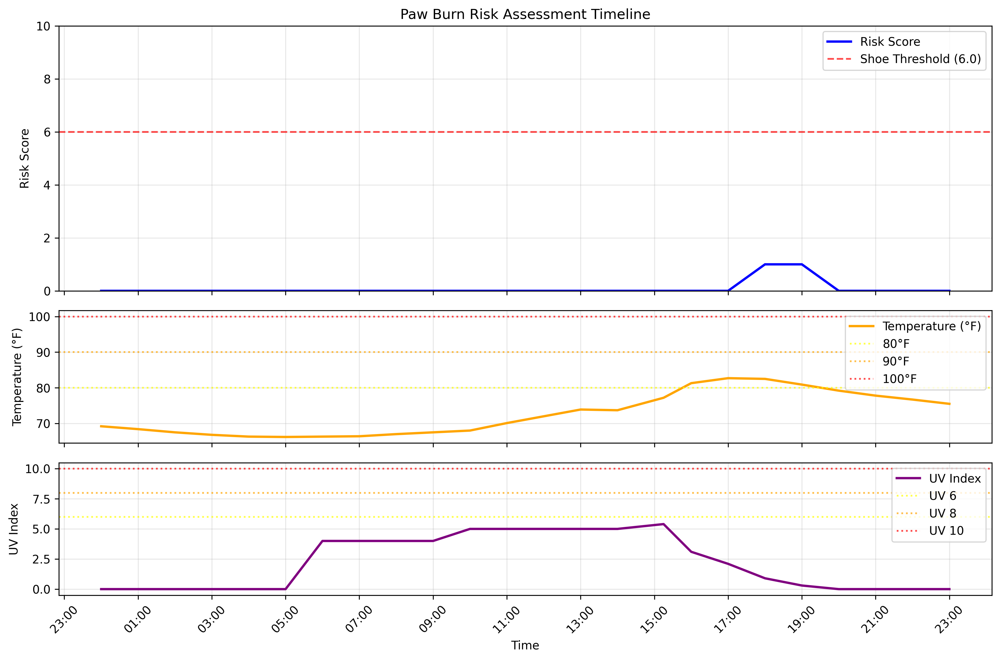
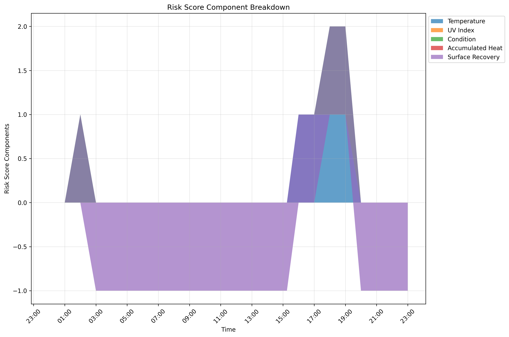
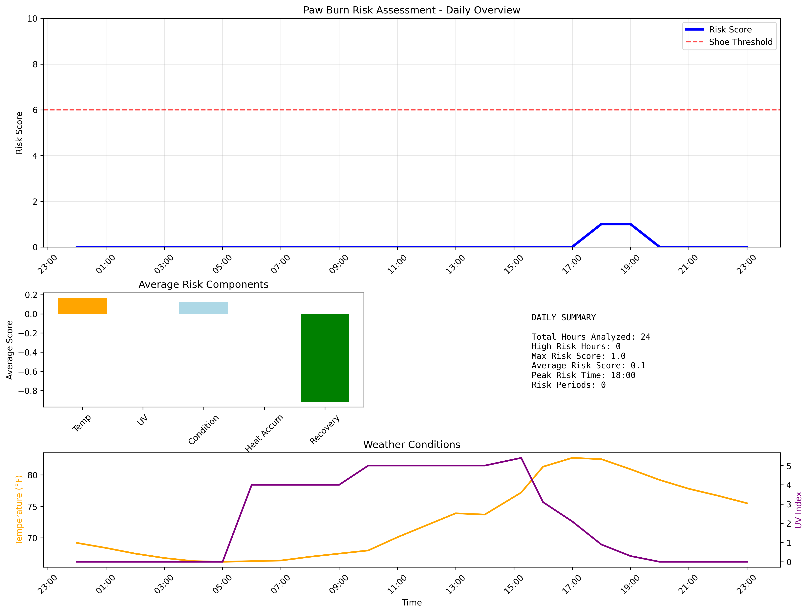

# 🐾 Paw Burn Risk Assessment Tool

A Python application that assesses paw burn risk for dogs based on weather conditions including temperature, UV index, and other environmental factors. The tool provides hourly risk scores, recommendations for protective footwear, and visualizations to help keep your furry friend safe.

## Features

- **Weather Data Integration**: Fetches historical, current, and forecast weather data from WeatherAPI.com
- **Smart Risk Scoring**: Calculates risk scores based on multiple factors:
  - Air temperature (80°F, 90°F, 100°F+ thresholds)
  - UV index (6, 8, 10+ thresholds)
  - Weather conditions (sunny/clear conditions)
  - Accumulated heat (rolling 2-hour average)
  - Surface recovery time (cooling after peak temperatures)
  - Rapid temperature swings detection
- **Intelligent Recommendations**: Provides actionable advice on when to use protective dog shoes
- **Data Persistence**: Stores weather and risk data in SQLite database
- **Rich Visualizations**: Creates comprehensive plots and dashboards
- **Configurable Parameters**: Customize thresholds and assessment criteria
- **Terminal Output**: Clean, formatted output for development and monitoring

## Installation

1. **Clone or download the project files**

2. **Install dependencies**:
   ```bash
   pip install -r requirements.txt
   ```

3. **Set up environment variables**:
   - Copy `env_template.txt` to `.env`
   - Sign up for a free API key at [WeatherAPI.com](https://www.weatherapi.com/)
   - Add your API key to the `.env` file:
     ```
     WEATHER_API_KEY=your_actual_api_key_here
     DEFAULT_LOCATION=Your City
     ```

4. **Test your setup**:
   ```bash
   python test_setup.py
   ```

## 🚀 Quick Start

1. **Get your API key**: Sign up at [WeatherAPI.com](https://www.weatherapi.com/) (free)
2. **Set up environment**: `cp env_template.txt .env` and add your API key
3. **Install dependencies**: `pip install -r requirements.txt`
4. **Test setup**: `python test_setup.py` (should show all ✅)
5. **Run assessment**: `python main.py --location "90210"`

## Usage

### Basic Usage

Run a basic risk assessment for your default location:
```bash
python main.py
```

### Command Line Options

```bash
python main.py [OPTIONS]

Options:
  -l, --location TEXT     Specify location (city, zip code, coordinates)
  -d, --detailed         Show detailed hourly breakdown
  -p, --plot            Display interactive plots
  -s, --save-plots      Save plots to files
  --no-recommendations  Skip recommendations output
  --config-check        Check configuration and exit
```

### Examples

**Basic assessment for a specific location:**
```bash
python main.py --location "Phoenix, AZ"
```

**Using zip codes:**
```bash
python main.py --location "85001"  # Phoenix, AZ zip code
python main.py --location "90210"  # Beverly Hills, CA zip code
```

**Detailed hourly breakdown with plots:**
```bash
python main.py --detailed --plot
```

**Save plots for reporting:**
```bash
python main.py --save-plots --location "Las Vegas, NV"
# Plots saved to plots/ directory (auto-created and cleared each run)
```

**Combine detailed analysis with plots:**
```bash
python main.py --location "90210" --detailed --save-plots
```

## Risk Scoring System

The tool uses a comprehensive scoring system (0-10 scale) with the following components:

### Temperature Score
- +1 if ≥ 80°F
- +2 if ≥ 90°F  
- +3 if ≥ 100°F

### UV Index Score
- +1 if ≥ 6
- +2 if ≥ 8
- +3 if ≥ 10

### Weather Condition Score
- +1 if sunny or clear conditions

### Accumulated Heat Score
- +1 if 2-hour rolling average temperature > 85°F OR average UV ≥ 6

### Surface Recovery Score
- -1 if > 2 hours since last 90°F+ reading (cooling bonus)

### Additional Factors
- +0.5 bonus for rapid temperature swings (15°F+ change in 1 hour)

**Shoe Recommendation Threshold**: ≥ 6.0 (configurable)

## Configuration

All parameters can be customized via environment variables in your `.env` file:

```bash
# Temperature thresholds (°F)
TEMP_THRESHOLD_LOW=80
TEMP_THRESHOLD_MED=90
TEMP_THRESHOLD_HIGH=100

# UV Index thresholds
UV_THRESHOLD_LOW=6
UV_THRESHOLD_MED=8
UV_THRESHOLD_HIGH=10

# Risk assessment
RISK_THRESHOLD_SHOES=6
ROLLING_WINDOW_HOURS=2
SURFACE_RECOVERY_HOURS=2

# Surface recovery enhancements (Optional)
SURFACE_RECOVERY_TEMP_THRESHOLD=90   # Temperature threshold to start recovery period (°F)
SURFACE_TYPE=asphalt                 # Options: asphalt, concrete, mixed, grass
SURFACE_MAX_RECOVERY_SCORE=2.0       # Maximum recovery score reduction with graduated recovery
ENABLE_GRADUATED_RECOVERY=true       # Enable graduated recovery (more cooling time = more benefit)
ENABLE_TIME_OF_DAY_FACTOR=true       # Apply day/night cooling adjustments
```

### Surface Recovery Feature

The application includes an enhanced surface recovery model that accounts for cooling of surfaces after peak temperatures:

- **Basic Recovery**: Surfaces begin to cool after being exposed to high temperatures (above `SURFACE_RECOVERY_TEMP_THRESHOLD`). After `SURFACE_RECOVERY_HOURS`, a recovery credit reduces the risk score.

- **Graduated Recovery**: When enabled, provides a progressively stronger recovery benefit as more cooling time passes, up to `SURFACE_MAX_RECOVERY_SCORE`.

- **Surface Type**: Different surfaces cool at different rates:
  - Asphalt: Slowest cooling (coefficient 0.7)
  - Concrete: Moderate cooling (coefficient 0.85)
  - Mixed: Standard cooling (coefficient 1.0)
  - Grass: Fastest cooling (coefficient 1.5)

- **Time-of-Day**: When enabled, night hours (7pm-6am) provide 30% faster cooling than daylight hours.

- **Sun Exposure**: The algorithm considers sun exposure during the recovery period, which can slow cooling by up to 30%.

These factors combine to provide a more accurate assessment of surface temperatures throughout the day and the resulting paw burn risk.

## Output Examples

### Summary Output
```
🐾 Paw Burn Risk Assessment Tool
========================================
🌤️  Fetching weather data for Phoenix, AZ...
📊 Retrieved 24 hours of weather data
🧮 Calculating paw burn risk scores...

🐕 PAW BURN RISK ASSESSMENT - PHOENIX, AZ
============================================================

📈 DAILY SUMMARY:
   • Total Hours Analyzed: 24
   • High Risk Hours: 8
   • Maximum Risk Score: 8.5/10
   • Average Risk Score: 4.2/10
   • Peak Risk Time: 15:00
   • Continuous Risk Periods: 2

⏰ HIGH RISK TIME PERIODS:
   • 11:00 - 13:00 (2.0 hours)
   • 14:00 - 18:00 (4.0 hours)

💡 RECOMMENDATIONS:
   ⚠️  Protective dog shoes recommended for 8 hours today.
   🕐 Avoid walks during the identified high-risk time periods, or ensure your dog wears protective booties.
   🌡️  HIGH RISK: Hot surfaces likely. Test pavement with your hand - if too hot for 5 seconds, it's too hot for paws.
```

### Plot Output (when using --save-plots)
```
📁 Plots directory ready: plots/
📊 Generating and saving visualizations...
📊 Plot saved: plots/risk_timeline_Phoenix_AZ_20250607_152345.png
📊 Plot saved: plots/risk_components_Phoenix_AZ_20250607_152345.png
📊 Plot saved: plots/risk_dashboard_Phoenix_AZ_20250607_152345.png
```

### Detailed Hourly Output
```
🕐 HOURLY BREAKDOWN:
--------------------------------------------------------------------------------
  Time   Temp   UV    Condition     Risk   Shoes
--------------------------------------------------------------------------------
  06:00    75°F  1.0        Clear      1.0  ✅    no
  07:00    78°F  2.0        Clear      1.0  ✅    no
  08:00    82°F  4.0        Clear      2.0  ✅    no
  ...
  14:00    98°F  9.0        Sunny      7.0  ⚠️   YES
  15:00   102°F 10.0        Sunny      8.5  ⚠️   YES
  16:00    99°F  8.0        Sunny      7.0  ⚠️   YES
```

## Data Storage & Output

### Database
The application stores data in a SQLite database (`paw_risk.db` by default) with tables for:
- **weather_data**: Historical weather observations
- **risk_scores**: Calculated risk assessments

This enables:
- Historical trend analysis
- Performance tracking over time  
- Offline analysis of past data

### Plot Files
When using `--save-plots`, visualizations are saved to:
- **plots/** directory (auto-created)
- **Cleared on each run** to contain only latest analysis
- **Files include location and timestamp** for identification
- **Formats**: High-resolution PNG files (300 DPI)

## Visualizations

The tool generates several types of high-quality plots:

### 1. Risk Timeline
Main risk score over time with threshold indicators, temperature, and UV data:



### 2. Component Breakdown  
Stacked visualization showing how each risk factor contributes over time:



### 3. Summary Dashboard
Comprehensive overview combining risk timeline, statistics, and weather conditions:



**Plot Features:**
- High-resolution PNG output (300 DPI)
- Clear time-based x-axis with hourly markers
- Color-coded risk thresholds and warnings
- Interactive legends and detailed annotations
- Professional styling suitable for reports

## Advanced Features

### Data Gap Handling
- Interpolates missing UV index values using nearby hours
- Falls back to temperature-based UV estimation when necessary
- Robust error handling for API inconsistencies

### Rapid Heat Swing Detection
- Monitors for sudden temperature changes (15°F+ per hour)
- Applies additional risk scoring for volatile conditions
- Logs warnings for extreme temperature variations

### Flexible Location Support
- **City names**: "New York", "Los Angeles"
- **City, State**: "Phoenix, AZ", "Miami, FL"
- **City, Country**: "London, UK", "Tokyo, Japan"
- **Zip codes**: "10001", "90210", "33101"
- **Coordinates**: "40.7128,-74.0060"
- Automatic location validation
- Configurable default location

## Project Structure

### Core Files
- **`main.py`**: CLI application and coordination
- **`config.py`**: Configuration management
- **`models.py`**: Data models and database operations  
- **`weather_api.py`**: WeatherAPI.com integration
- **`risk_calculator.py`**: Core risk assessment logic
- **`plotting.py`**: Visualization and charting

### Setup & Testing
- **`requirements.txt`**: Python dependencies
- **`env_template.txt`**: Environment variables template
- **`test_setup.py`**: Setup verification script
- **`README.md`**: This documentation

### Generated Files (Ignored by Git)
- **`plots/`**: Generated visualization files
- **`.env`**: Your personal API keys and settings
- **`paw_risk.db`**: SQLite database with weather and risk data
- **`*.png`**: Individual plot files (when saved outside plots/ dir)

## Contributing

The codebase is modular and extensible - feel free to enhance any component!

## Requirements

- Python 3.7+
- Internet connection for weather data
- WeatherAPI.com account (free tier available)

## License

This project is designed for pet safety and educational purposes. Please ensure you're following WeatherAPI.com's terms of service for API usage.

## Safety Note

This tool provides guidance based on environmental conditions, but always use your best judgment when it comes to your pet's safety. Factors like breed, age, paw pad condition, and individual sensitivity can vary significantly between dogs. 